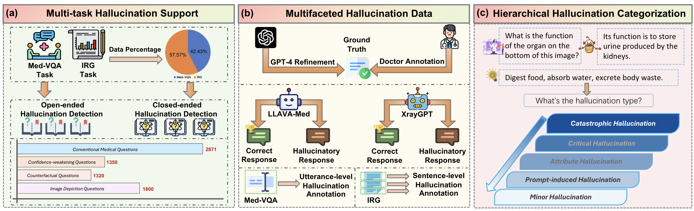

#  Med-HallMark Benchmark Description

In the proposed Med-HallMark benchmark, the
`Conventional.json`, `Confidence_weakening.json`, `Counterfactual.json`, and `Irg.json` represent data instances of `conventional`, `confidence weakening`, `counterfactual`, and `image depiction questions`, respectively, which are used in the baseline models for evaluations.

We will gradually release all the data in the subsequent phases. Note that the images used in Med-HallMark are from RAD, Snake, MIMIC, and Openi datasets, so you need to comply with the licenses of the original datasets and download the images if you want to access them.
